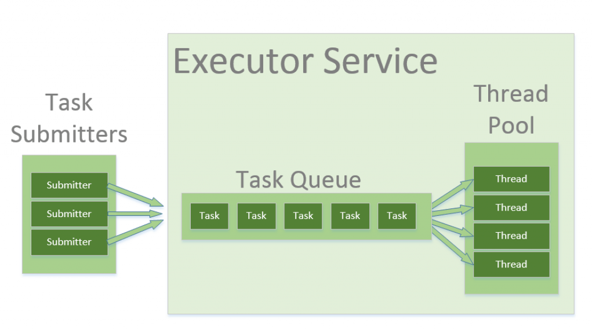

# Intro to Concurrency/Threads

### Concurrency

Application can do more than one thing at a time (e.g. fetching chunks of data and making some changes upon them). Meaning that one task doesn't have to complete before another one can start.

While working on threads we rely at mercy of JVM and OS when it comes to when threads are scheduled to run.

### Process

Process is a unit of execution that has its own memory space. Each instance of JVM runs as a process, when we run Java console application or JavaFx application we're kicking off a process.

Term process and application are commonly used interchangeably.

Each Java process has its own memory space of **heap**. Heap isn't shared between applications.

### Thread

Thread is a unit of execution **within process**. Each process can have multiple threads and in Java every process have at least one thread - the main thread.

In fact just about every Java process also has multiple system threads for example for I/O tasks or memory management but we don't explicitly create those threads.

Creating thread doesn't require as many resources as createing a process. Every thread crated by process shares the process's **memory** and **files**.

Each thread has own **thread stack** which can be accessed only by this thread.

### Why to use many threads?

1. Performing task that takes a long time to execute (e.g. quering a db, fetching data from web). If we don't outsource this task to thread, then main thread will be blocked.
1. Running some code on external thread.

### Deadlock

Deadlock is a situation where a set of threads are blocked because each thread is holding a resource and waiting for another resource acquired by some other thread.

Same thing applies to processes.

# Thread Pools

In Java, threads are mapped to system-level threads, which are the operating
system's resources. If we create threads uncontrollably, we may run out of
these resources quickly.

The operating system does the context switching between threads as well — in
order to emulate parallelism. A simplistic view is that the more threads we
spawn, the less time each thread spends doing actual work.

The Thread Pool pattern helps to save resources in a multithreaded
application and to contain the parallelism in certain predefined limits.

When we use a thread pool, we write our concurrent code in the form of
parallel tasks and submit them for execution to an instance of a thread pool.
This instance controls several re-used threads for executing these tasks.
