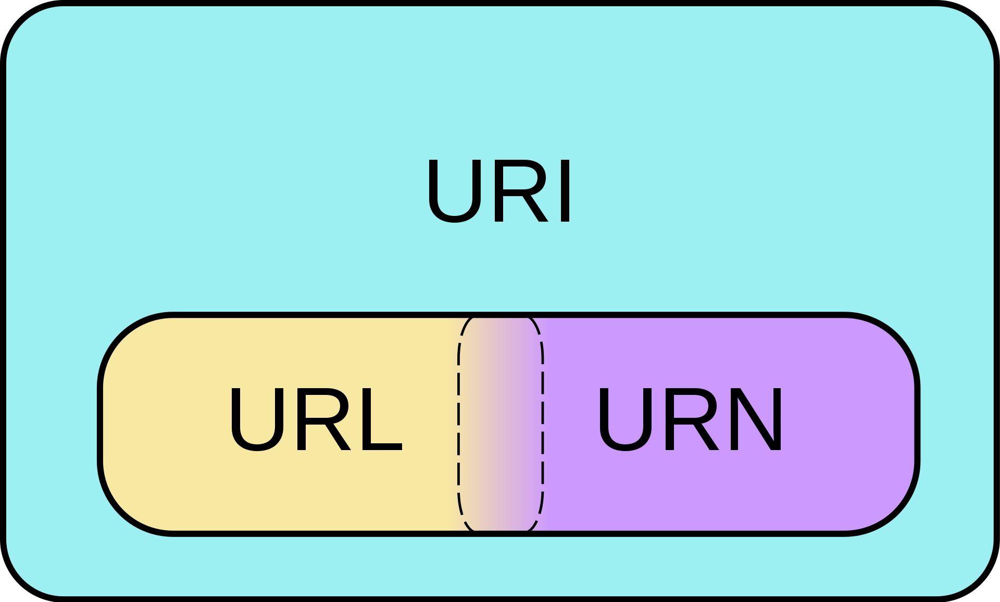

## Dictionary

1. Host - machine that takes part in data exchange or provide network services through computer network. It uses TCP/IP communication protocol and has own IP address.
1. Client/Server configuration - one (or more) host acting as server, other hosts are clients connected to server.
1. IP - Internet Protocol.
1. Port - usually host is connected to one physical internet connection. If we have multiple apps running, incoming data has to be routed to appropriate application. Routing is done with help of ports, each app is assigned a port.
1. Socket - is one end-point of two-way connection. Each client have own socket and server has own socket as well.
1. Handshaking - establishing connection between client and server.
1. Packets - data is being sent using packets, which must be in specific format.
1. Transport Protocol - TCP or UDP protocol used for communication between hosts.

## Protocols

### TCP - Transmission Control Protocol

- reliable
- connection-oriented (establishes stable connection)
- guarantees that message will arrive to destination
- reliability requires overhead that affect performance

It provides reliable, ordered, and error-checked delivery of data between applications running on hosts communicating via an IP network. Handshaking is required before communication, so client has to connect to server and server has to accept that request. Then client sends requests and server sends responses. It's a two-way connection and there's tight coupling between server and client.

Use cases:

- file transfer,
- text communication,
- HTTP (HyperText Transport Protocol),
- SMTP (Simple Mail Transfer Protocol).

### UDP - User Datagram Protocol

- not as reliable as TCP
- connectionless (no establishing stable connection)
- no guarantee that message will arrive to destination
- pays off with better performance

In UDP messages that are being send are called datagrams and are self-contained (not like req/res). It has no handshaking dialogues, and thus exposes the user's program to any unreliability of the underlying network. There is no guarantee of delivery, ordering, or duplicate protection.

Use cases:

- online games,
- video chats,
- VoIP (Voice Over IP)

### URI vs URL

Every URL is also a URI (but not the other way). According to www websites URI is equal with URL. That's why both termines are often used interchargeably. However URI can identify almost everything, files on disk, contacts, records in calendar. Identification URI with URL is a big simplification.

- URI - Uniform Resource Identifier acts as identifier but might not provide enough information to access the resource it identifies. URI can be absolute or relative path.
- URL - Uniform Resource Locator is also an identifier but it includes information about how to access the resource it identifies. By definition it shows location of specific resource. URL is always absolute path.

